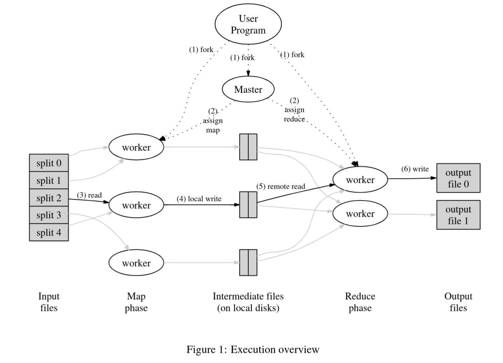
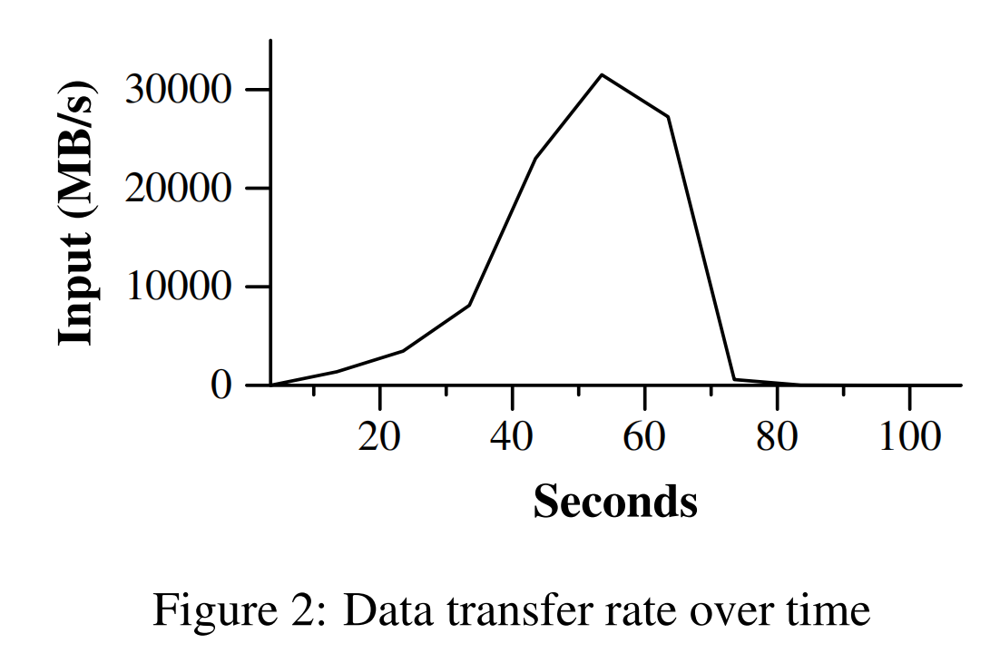
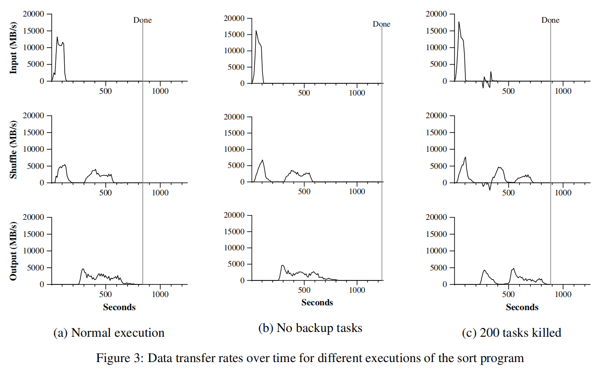
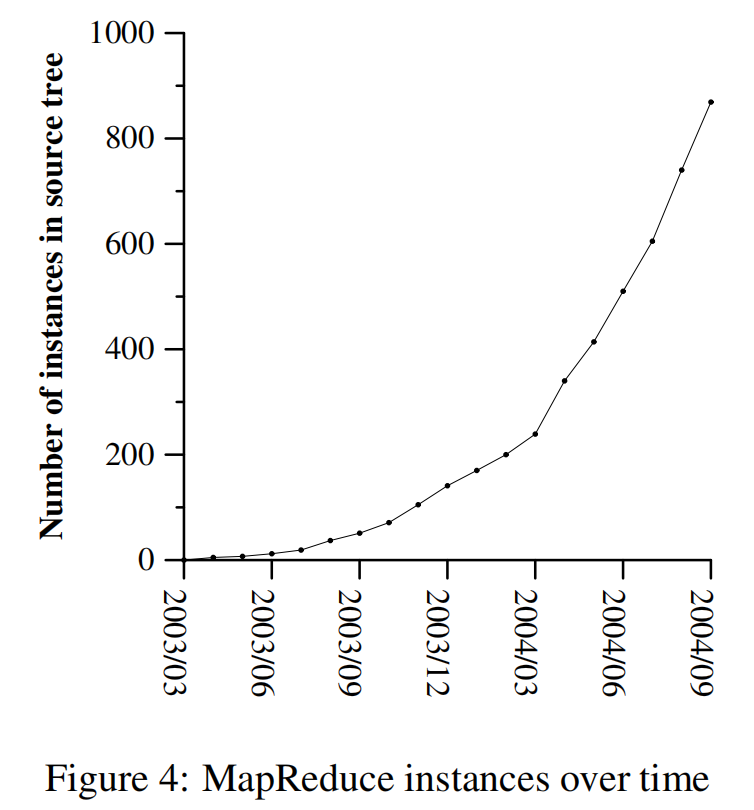
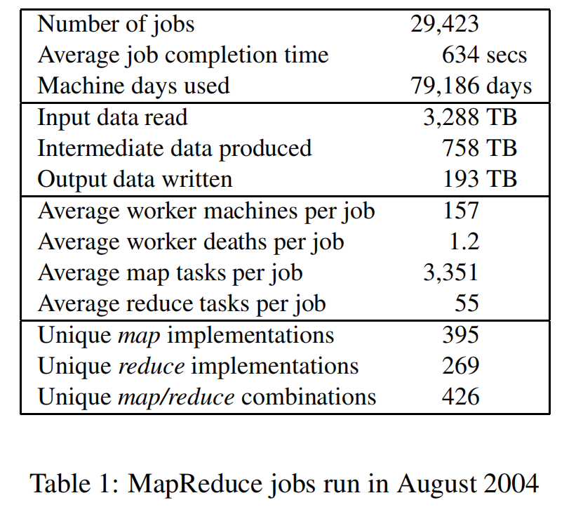

# Mapreduce: 大规模集群上的简化处理 #

## 摘要 ##

MapReduce 是一个处理和生成大规模数据集的编程模型和相关实现。用户指定处理键/值对以生成一组中间键/值对的map函数，以及指定归纳与同一中间键关联的所有中间值的reduce函数。 如本文所示，许多现实世界中的任务在此模型中均可表达。

以这种函数风格编写的程序会自动并行化，并在大型商品计算机集群上执行。 运行时系统负责划分输入数据，安排程序在一组机器上的执行，处理机器故障以及管理所需的机器间通信的细节。 这使得没有并行和分布式系统经验的程序员可以轻松地利用大型分布式系统的资源。我们的MapReduce实现在大型商用机器上运行，并且具有高度可扩展性：典型的MapReduce计算过程可处理数兆兆字节的数据 在数千台机器上。 程序员发现该系统易于使用：每天执行数百个MapReduce程序，每天在Google集群上执行多达一千个MapReduce作业。

## 1 概要 ##
在过去的五年中，Google的作者和其他许多人已经实施了数百种特殊用途的计算，可以处理大量原始数据（例如抓取的文档，Web请求日志等），以计算各种衍生数据，例如反向索引， Web文档的图形结构的各种表示形式，每个主机抓取的页面数的摘要，给定日期中最频繁查询的集合等。大多数此类计算在概念上很简单。但是，输入数据通常很大，必须在数百或数千台计算机上分布计算，才能在合理的时间内完成计算。有关如何对计算进行同等化，分配数据以及处理失败的问题，旨在使原始的简单计算难以用大量复杂的代码来掩盖，以解决这些问题。针对这种复杂性，我们设计了一种新的抽象方法我们来表达我们试图执行的简单计算，但是在库中隐藏了并行化，容错，数据分发和负载平衡的混乱细节。 Lisp 和许多其他功能语言中的mapandreduce原语启发了我们的抽象。我们意识到，我们的大多数计算都涉及对输入中的每个逻辑“记录”应用加乘运算，以便计算出一组中间键/值对，然后对所有共享同一键的值应用演绎运算，以便将派生结果组合在一起。适当的数据。我们使用具有用户指定的映射和归约运算的功能模型，使我们能够轻松地对大型计算进行并行处理，并使用重新执行作为容错的主要机制。这项工作的主要贡献是一个简单而强大的界面，该界面可实现自动大规模计算的并行化和分布，以及该接口的实现，可以在大型商用PC集群上实现高性能。第二部分介绍了基本的编程模型，并给出了几个示例。第3节描述了针对我们基于集群的计算环境量身定制的MapReduce接口的实现。第4节描述了一些有用的编程模型改进。第五部分对我们执行各种任务的性能进行了评估。第6部分探讨了Google内部MapReduce的用法，包括我们使用它作为重写生产索引系统基础的经验。第7节讨论相关和未来的工作

## 2 编程模型 ##

该计算采用一组输入键/值对，并产生一组输出键/值对。 MapReduce库的用户将计算表示为两个功能：Map和Reduce。由用户编写的Map接受一个输入对，并产生一组中间键/值对。 MapReduce库将与同一中间键 $I$ 关联的所有中间值分组在一起，然后将它们传递给Reduce函数。Reduce函数也由用户编写，可以接受中间键I和该键的一组值。 将这些值合并在一起以形成可能较小的一组值。 通常，每个Reduce调用仅产生零个或一个输出值。 中间值通过迭代器提供给用户的reduce函数。 这使我们能够处理太大而无法容纳在内存中的值列表。

### 2.1 样例 ###

考虑对大量文档中每个单词的出现次数进行计数的问题。 用户将编写类似于下面的伪代码的代码：

~~~bash
map(String key, String value):
    // key: document name
    // value: document contents
    for each word w in value:
        EmitIntermediate(w, "1");
reduce(String key, Iterator values):
    // key: a word
    // values: a list of counts
    int result = 0;
    for each v in values:
        result += ParseInt(v);
    Emit(AsString(result));
~~~

$map$函数会发出每个单词以及相关的出现次数（在此简单示例中为“1”）。$reduce$函数会将特定单词发出的所有计数加在一起。

另外，用户编写代码以使用输入和输出文件的名称以及可选的调整参数来填充$mapreduce$规范对象。 然后，用户调用MapReduce函数，并将其传递给指定对象。 用户代码与$MapReduce$库（在C++中实现）链接在一起。 附录A包含此示例的完整程序文本。

### 2.2 类型 ###

即使先前的伪代码是根据字符串输入和输出编写的，但从概念上讲，用户提供的map和reduce函数具有关联的类型：

map    (k1,v1)       → list(k2,v2)

reduce (k2,list(v2)) → list(v2)

即，输入键和值是从与输出键和值不同的域中提取的。 此外，中间键和值与输出键和值来自同一域。我们的C++实现将字符串与用户定义的函数传递来回，并将其留给用户代码以在字符串和适当的类型之间进行转换。

### 2.3 更多的例子 ###

这是一些有趣的程序的简单示例，可以轻松地表达为MapReduce计算

**分布式Grep**：如果匹配提供的模式，则map函数将发出一条线。 reduce函数是一个身份函数，它仅将提供的中间数据复制到输出中。

**URL访问频率计数**：地图功能处理网页请求日志并输出<URL，1>。 reduce函数将同一URL的所有值加在一起，并发出一个<URL，total count>对。

**反向Web链接图**：map函数为指向在名为source的页面中找到的targetURL的每个链接输出<target，source>对。 reduce函数将与给定目标URL相关联的所有源URL的列表连接起来，并发出一对：<target，list（source）>

**每个主机的术语向量**：术语向量将一个文档或一组文档中出现的最重要的单词汇总为<单词，频率>对的列表。 map函数为每个输入文档（主机名称是从文档的URL中提取的）发出一个<hostname，term vector>对。 re-duce函数传递给给定主机的所有每个文档术语向量。它将这些术语向量相加，丢弃不常用的术语，然后发出最终的<主机名，术语向量>对

**倒序索引**：map函数解析每个文档，并发出一系列<单词，文档ID>对。 reduce函数接受给定单词的所有对，对相应的文档ID进行排序，并发出一个<word，list（document ID)>对。 所有输出对的集合形成一个简单的反向索引。 很容易扩充此计算以跟踪单词位置。

**分布式排序**：map函数从每个记录中提取键，并发出一个<key，record>对。 衰减功能将所有对保持不变。该计算取决于第4.1节中描述的分区工具和第4.2节中描述的排序属性。

## 3 实现 ##

MapReduce接口的许多不同实现都是可能的。 正确的选择取决于环境。 例如，一种实现可能适用于小型共享内存计算机，另一种实现适用于大型NUMA多处理器，而另一种实现适用于网络计算机的更大集合。

本部分介绍了针对Google广泛使用的计算环境的实现：

与交换以太网连接在一起的大型商用PC集群[4]。 在我们的环境中：

- （1）机器通常是运行Linux的双处理器x86处理器，每台机器具有2-4 GB的内存。

- （2）使用商品网络硬件–在机器级别通常为100兆比特/秒或1吉比特/秒，但平均平均对分带宽要小得多。

- （3）群集由数百或数千个机器组成，因此机器故障很常见。

- （4）由便宜的IDE磁盘提供存储，这些磁盘直接附加到单个计算机。 内部开发的分布式文件系统[8]用于管理存储在这些磁盘上的数据。 文件系统使用复制在不可靠的硬件之上提供可用性和可靠性。

- （5）用户将作业提交到计划系统。 每个作业由一组任务组成，并由调度程序映射到集群中的一组可用计算机。

### 3.1 执行概述 ###

通过将输入数据自动划分为一组M个拆分，Map调用可分布在多台计算机上。 输入拆分可以由不同的机器并行处理。通过使用分区函数（例如，hash（key）modR）将中间键空间划分为R个片段来减少调用的分布。 分区数（R）和分区功能由用户指定。

图1显示了我们实现中MapReduce操作的总体流程。 当用户程序调用MapReduce函数时，将发生以下一系列操作（图1中的编号标签与以下列表中的编号相对应）

1. 用户程序中的MapReduce库首先将输入文件分割成通常为每片16兆字节至64兆字节（MB）的块（可由用户通过可选参数进行控制）。然后，它会在许多机器上启动该程序的许多副本。

2. 该程序的副本之一是特殊副本-主副本。其余的是由主委派工作的工人。有Mmap任务和减少任务。主人选择空闲的工人，并为每个工人分配一个地图任务或一个简化任务。

3. 分配了地图任务的工作人员将读取相应输入拆分的内容。它从输入数据中解析键/值对，并将每个对传递给用户定义的Map函数。 Map函数产生的中间键/值对被缓存在内存中。

4. 定期将缓冲对写入本地磁盘，并通过分区功能划分为R区域。这些缓冲对在本地磁盘上的位置被传递回主服务器，主服务器负责将这些位置转发给减少工作人员。

5. 当主服务器通知reduce worker这些位置时，它将使用远程过程调用从map worker的本地磁盘读取缓冲的数据。当reduce worker读取了所有中间数据时，它将按中间键对其进行排序，以便将同一键的所有出现都归为一类。之所以需要排序，是因为通常有许多不同的键映射到相同的reduce任务。如果中间数据量太大而无法容纳内存，则使用外部排序。

6. reduceworker迭代排序的中间数据，并为遇到的每个唯一的中间键，将键和相应的中间值集传递给用户的reducefunction。 Reduce函数的输出将附加到此reduce分区的最终输出文件中

7. 完成所有map任务和归约任务后，主服务器将唤醒用户程序。这时，用户程序中的MapReduce调用将返回到用户代码。

成功完成后，可在R个输出文件中执行mapreduce执行的输出（每个reduce任务一个，其文件名由用户指定）。通常，用户不需要将这些R个输出文件合并为一个文件–他们通常会传递这些文件作为另一个MapReduce调用的输入，或从另一个能够处理划分为多个文件的输入的分布式应用程序中使用它们。

### 3.2 主数据结构 ###

主机保留几个数据结构。 对于每个map任务和reduce任务，它都存储状态（空闲，进行中或已完成）和工作机的标识（对于非空闲任务）。主节点是中间文件位置的传输渠道 从地图任务传播区域以减少任务。 因此，对于每个完成的地图任务，母版存储由地图任务生成的R个中间文件区域的位置和大小。 地图任务完成后，将接收到此位置和大小信息的更新。 信息将逐步推送给正在进行减少任务的工作人员。

### 3.3 容错 ###

由于MapReduce库旨在帮助使用数百或数千台计算机处理大量数据，因此该库必须能够容忍机器故障。

**worker失败** 

主人定期对每个工人执行ping操作。 如果在一定时间内没有收到来自worker的响应，则主服务器将workr标记为失败。 由工作人员完成的所有maptask都将重置为其初始空闲状态，因此有资格在其他工作人员上进行调度。 同样，在失败的工作程序上进行的任何映射任务或约简任务也将重置为空闲，并有资格进行重新计划。

完成的映射任务在发生故障时会重新执行，因为它们的输出存储在故障机器的本地磁盘上，因此可以访问。 已完成的化简任务的输出存储在全局文件系统中，因此无需重新执行。

如果先由workerA执行映射任务，然后再由workerB执行（因为失败），则所有执行reduce任务的工作程序都会收到重新执行的通知。 任何尚未从workerA读取数据的reduce任务都会从workerB读取数据。

MapReduce可以抵抗大规模的工作故障。例如，在一个MapReduce操作期间，正在运行的群集上的网络维护导致一次由80台计算机组成的群组在数分钟内无法访问。 MapReduce主节点只是简单地重新执行了无法访问的工作机所完成的工作，并继续向前发展，最终完成了MapReduce操作。

**Master Failure**

使主服务器很容易写入上述主数据结构的定期检查点。 如果主任务死亡，则可以从最后一个检查点状态开始新的副本。 但是，由于只有单个主服务器，因此它的失败可能性不大。 因此，如果主服务器失败，我们的当前实现将中止MapReduce计算。 客户可以检查这种情况，并根据需要重试MapReduce操作。

**存在故障的语义学**

当用户提供的map和reduce运算符是其输入值的确定性函数时，我们的分布式实现将产生与整个程序的无故障顺序执行所产生的输出相同的输出。

我们依靠map的原子提交，并减少任务输出来实现此属性。 每个正在进行的任务将其输出写入私有临时文件。 reduce任务产生一个这样的文件，而map任务产生R个这样的文件（每个reduce任务一个）。 map任务完成后，工作人员会向主服务器发送一条消息，并在消息中包含临时文件的名称。 如果主服务器收到有关已完成的map任务的完成消息，它将忽略该消息。 否则，它将R文件的名称记录在主数据结构中。

当reduce任务完成时，reduce worker会自动将其临时输出文件重命名为最终输出文件。 如果在多台计算机上执行相同的reduce任务，则将对同一最终输出文件执行多个重命名调用。 我们依靠基础文件系统提供的原子重命名操作来确保最终文件系统状态仅包含执行一次reduce任务所产生的数据。

我们的map和reduce运算符绝大多数是确定性的，在这种情况下我们的语义等同于顺序执行的事实使程序员很容易就其程序行为进行推理。 当map和/或reduce运算符不确定时，我们提供较弱但仍然合理的语义。 在存在不确定性运算符的情况下，特定归约任务R1的输出等效于顺序执行该不确定性程序所产生的R1输出。 然而，用于不同归约任务R2的输出可以对应于由不确定性程序的不同顺序执行所产生的用于R2的输出。

考虑映射任务M并简化任务R1和R2。令e（Ri）是已落实的Ri的执行（恰好是这样的一个执行）。 之所以出现较弱的语义，是因为e（R1）可能已经读取了一次执行M所产生的输出，而e（R2）可能已经读取了执行不同的M所产生的输出。

### 3.4 Locality ###

在我们的计算环境中，网络带宽是相对稀缺的资源。 我们利用输入数据（由GFS [8]管理）存储在组成集群的计算机的本地磁盘上的事实，从而节省了网络带宽。 GFS将每个文件分成64 MB的块，并在不同的计算机上存储每个块的几个副本（通常为3个副本）。 MapReduce主服务器将输入文件的位置信息考虑在内，并尝试在包含相应输入数据副本的计算机上计划地图任务。 如果失败，它将尝试将地图任务安排在该任务输入数据的副本附近（例如，在与包含数据的计算机位于同一网络交换机的工作机上）。 当在集群中的大部分工作人员上运行大型MapReduce操作时，大多数输入数据都在本地读取，并且不占用网络带宽。

### 3.5 Task Granularity ###

如上所述，我们将映射阶段细分为M个片段，将还原阶段细分为R个片段。理想情况下，M和R应该比工作机器的数量大得多。让每个工作程序执行许多不同的任务可以改善动态负载平衡，并且还可以在工作程序失败时加快恢复速度：它完成的许多映射任务可以分布在所有其他工作程序计算机上。

如上所述，由于主机必须制定O（M + R）调度决策并将O（M * R）状态保持在内存中，因此在我们的实现中可以有多大的M和R有实际的界限。 （但是，内存使用量的恒定因素很小：每个映射任务/减少任务对的状态的O（M * R）部分包含大约一个字节的数据。）

此外，R通常受用户约束，因为每个缩减任务的输出最终都存储在单独的输出文件中。实际上，我们倾向于选择M，以便每个单独的任务大约是16 MB到64 MB的输入数据（这样，上述的局部性优化才是最有效的），并且我们将R设为我们工作计算机数量的一小部分期望使用。我们经常使用2,000个工作机执行M = 200,000和R = 5,000的MapReduce计算。

### 3.6 Backup Tasks ###

延长MapReduce操作总时间的常见原因之一是“散乱者”：一台机器花费异常长的时间来完成最后几个地图之一或减少计算中的任务。散乱者会出现在整个主机上 原因。 例如，磁盘损坏的计算机可能会经常遇到可纠正的错误，从而将其读取性能从30 MB / s降低到1 MB / s。 集群调度系统可能已经在计算机上调度了其他任务，由于竞争CPU，内存，本地磁盘或网络带宽，导致其执行MapReduce代码的速度变慢。 我们最近遇到的一个问题是机器初始化代码中的一个错误，该错误导致了处理器缓存被禁用：受影响机器上的计算速度降低了100倍。

我们有一个通用的机制来缓解流浪汉的问题。 当MapReduce操作接近完成时，主服务器会调度其余正在进行的任务的备份执行。 每当主执行或备份执行完成时，该任务就会标记为已完成。 我们已经对该机制进行了调整，以使其通常将操作使用的计算资源增加不超过百分之几。我们发现，这显着减少了完成大型MapReduce操作的时间。 例如，禁用备份任务机制时，第5.3节中描述的排序程序需要44％的时间才能完成。

## 4  Refinements ## 

尽管简单地编写Map和Reduce函数提供的基本功能足以满足大多数需求，但我们发现一些扩展很有用。 这些将在本节中介绍。

### 4.1  Partitioning Function ###

MapReduce的用户指定他们想要的（R）缩减任务/输出文件的数量。 使用中间键上的分区功能，可以跨这些任务对数据进行分区。 提供了一个默认的分区功能，该功能使用哈希（例如“ hash（key）mod R”）。这往往会导致分区平衡得很好。 但是，在某些情况下，通过键的其他功能对数据进行分区很有用。 例如，有时输出键是URL，我们希望单个主机的所有条目都以同一输出文件结尾。 为了支持这种情况，MapReduce库的用户可以提供特殊的分区功能。 例如，使用“ hash（Hostname（url key））mod R”作为分区功能会使来自同一主机的所有URL最终出现在同一输出文件中。

### 4.2  Ordering Guarantees ###

我们保证在给定的分区内，中间键/值对以递增的键顺序进行处理。 此排序保证使按分区轻松生成排序的输出文件，这在输出文件格式需要通过键支持有效的随机访问查找，或者输出的用户发现对数据进行排序很方便时很有用。

### 4.3  Combiner Function ### 

在某些情况下，每个映射任务产生的中间键会大量重复，并且用户指定的Reduce函数是可交换的和关联的。一个很好的例子是2.1节中的单词计数例子。由于单词频率倾向于遵循Zipf分布，因此每个地图任务都会产生成千上万个<the，1>形式的记录。所有这些计数将通过网络发送到单个减少任务，然后通过减少功能相加产生一个数字。我们允许用户指定一个可选的Combiner函数，该函数在通过网络发送该数据之前会进行部分合并。

在执行映射任务的每台计算机上执行合并器功能。通常，使用相同的代码来实现组合器和reduce函数。 Reduce函数和Combiner函数之间的唯一区别是MapReduce库如何处理函数的输出。 reduce函数的输出将写入最终输出文件。合并器函数的输出将写入一个中间文件，该文件将发送到reduce任务。部分合并可显着加快MapReduce操作的某些类。附录A包含一个使用组合器的示例。

### 4.4  Input and Output Types ###

MapReduce库提供了以几种不同格式读取输入数据的支持。例如，“文本”模式输入将每一行视为键/值对：键是文件中的偏移量，值是该行的内容。另一种受支持的常见格式存储按键排序的键/值对的顺序。每个输入类型的实现都知道如何将自己拆分为有意义的范围，以作为单独的地图任务进行处理（例如，文本模式的范围拆分可确保仅在行边界处进行范围拆分）。用户可以通过提供sim-plereader接口的实现来增加对新输入类型的支持，尽管大多数用户仅使用少量预定义输入类型之一。

读者不一定需要提供从文件读取的数据。例如，定义一个读取器很容易，它可以从数据库或映射到内存中的数据结构中读取记录。

以类似的方式，我们支持一组输出类型，用于生成不同格式的数据，并且用户代码很容易添加对新输出类型的支持。

### 4.5    Side-effects ###

在某些情况下，MapReduce的用户发现可以方便地从地图中生成辅助文件作为附加输出和/或reduce运算符。 我们依靠应用程序编写者来使此类副作用成为原子和幂等的。 通常，应用程序将写入临时文件，并在文件完全生成后以原子方式重命名该文件。

我们不支持单个任务生成的多个输出文件的原子两阶段提交，因此，生成具有跨文件一致性要求的多个输出文件的任务应该是确定性的。 实际上，这种限制从来都不是问题。

### 4.6    Skipping Bad Records ### 

有时用户代码中的错误会导致Map or Reduce函数确定性地崩溃某些记录。 此类错误会阻止MapReduce操作完成。 通常的做法是修复错误，但有时这是不可行的。 该错误可能是在第三方库中，该库的源代码不可用。 同样，有时可以忽略一些记录，例如在对大型数据集进行统计分析时。 我们提供了一种可选的执行模式，其中MapReduce库检测哪些记录导致确定性崩溃，并按顺序跳过这些记录以取得进展。

每个工作进程都安装一个信号处理程序，以捕获分段违规和总线错误。 在调用用户Map或Reduce操作之前，MapReduce库将参数的序列号存储在全局变量中。 如果用户代码生成信号，则信号处理程序将包含序列号的“最后一次喘息” UDP数据包发送到MapReduce主数据库。 当主服务器在特定记录上看到多个故障时，表明该记录在下一次重新执行相应的Map或Reduce任务时应跳过该记录。

### 4.7    Local Execution ###

Map或Reduce函数中的调试问题可能很棘手，因为实际的计算是在分布式系统中进行的，通常是在几千台机器上，而工作分配决定是由主服务器动态地做出的。 为了帮助进行调试，概要分析和小规模测试，我们开发了MapReduce库的替代实现，该库可在本地计算机上顺序执行MapReduce操作的所有工作。 提供给用户的控件使计算可以限于特定的地图任务。 用户使用特殊标志调用其程序，然后可以轻松使用他们认为有用的任何调试或测试工具（例如gdb）。

### 4.8    Status Information ###

主服务器运行一个内部HTTP服务器，并导出一组状态页面供人类使用。状态页显示了计算进度，例如显示了许多任务已完成，正在进行多少，输入字节，中间数据字节，输出字节，处理速率等。这些页面还包含指向标准错误和错误的链接。 每个任务生成的标准输出文件。 用户可以使用这些数据来预测计算将花费多长时间，以及是否应将更多资源添加到计算中。这些页面还可以用于确定何时计算速度比预期的慢得多。
## 4.9    Counters ###

MapReduce库提供了一种计数器功能，可以对各种事件的发生进行计数。 例如，用户代码可能要计算已处理的单词总数或索引的德语文档的数量等。要使用此功能，用户代码会创建一个命名计数器对象，然后在Map和/或Reduce函数中适当增加计数器。 例如：

~~~bash
Counter* uppercase;
uppercase = GetCounter("uppercase");
map(String name, String contents):
    for each word w in contents:
        if (IsCapitalized(w)):
            uppercase->Increment();
            EmitIntermediate(w, "1");
~~~

来自各个工作计算机的计数器值会定期传播到主服务器（在ping响应上pi带）。主服务器从成功的映射和归约任务中聚合计数器值，并在MapReduce操作完成时将其返回给用户代码。当前计数器值也显示在主状态页面上，以便人们可以观看实时计算的进度。汇总计数器值时，主服务器消除了重复执行同一映射或减少任务以避免重复计数的影响。 （重复执行可能是由于我们使用备份任务以及由于失败而重新执行任务引起的。）

MapReduce库会自动维护一些计数器值，例如处理的输入键/值对的数量和产生的输出键/值对的数量。

用户发现计数器功能对于完整性检查MapReduce操作的行为很有用。例如，在某些MapReduce操作中，用户代码可能想要确保生成的输出对的数量完全等于已处理的输入对的数量，或者要确保已处理的德语文档的比例在文档总数的某个可容忍的比例之内处理。

## 5  Performance ##

在本节中，我们将在大型计算机集群上运行的两个计算中测量MapReduce的性能。 一种计算可搜索大约1 TB的数据，以查找特定的模式。 其他计算将对大约1 TB的数据进行排序。

这两个程序代表了由MapReduce用户编写的真实程序的很大子集-一类程序将数据从一种表示形式改组为另一种表示形式，另一类程序从大型数据集中提取少量有趣的数据。

### 5.1  Cluster Configuration ###

所有程序都在由大约1800台计算机组成的集群上执行。 每台机器都有两个启用超线程的2GHz Intel Xeon处理器，4GB内存，两个160GB IDE磁盘和一个千兆以太网链接。 这些机器被安排在两级树形交换网络中，根部可提供大约100-200 Gbps的总带宽。 所有机器都在同一托管设施中，因此任何一对机器之间的往返时间都不到一毫秒。

在4GB的内存中，群集上运行的其他任务保留了大约1-1.5GB的内存。 这些程序在周末的一个下午执行，当时CPU，磁盘和网络大部分处于空闲状态。

### 5.2  Grep ###

grep程序扫描了 $10^{10}$ 100字节的记录，搜索了一个相对罕见的三字符模式（该模式出现在92337条记录中）。 输入分为大约64MB（M = 15000），整个输出放在一个文件中（R = 1）。

图2显示了计算超时的进度。 Y轴显示扫描输入数据的速率。 随着将更多计算机分配给此MapReduce计算，该速率逐渐提高，并在分配1764个工作人员时达到30 GB / s的峰值。随着地图任务完成，速率开始下降并在计算约80秒时达到零。 从开始到结束，整个计算大约需要150秒。 这包括大约一分钟的启动开销。 开销是由于程序传播到所有工作机，以及与GFS进行交互以打开1000个输入文件的集合以及获取进行位置优化所需的信息所导致的。

### 5.3 Sort ###

排序程序对1010个100字节的记录（大约1 TB的数据）进行排序。 该程序以TeraSort基准[10]为模型。

排序程序由少于50行的用户代码组成。 三行Map函数从文本行中提取10字节的排序键，并将该键和原始文本行作为中间键/值对发出。 我们使用内置的Identity函数作为Reduce运算符。 此函数传递不变的中间键/值对作为输出键/值对。 将最终排序的输出写入一组2向复制的GFS文件（即，将2 TB作为程序的输出写入）。

和以前一样，输入数据被分成64MB（M = 15000）。我们将排序后的输出划分为4000个文件（R = 4000）。分区功能使用密钥的初始字节将其分为R个片段之一。

我们针对该基准的分区功能建立在密钥分配的知识之上。在一般的排序程序中，我们将添加一个预传递MapReduce操作，该操作将收集键的样本并使用采样的键的分布来计算最终排序过程的分割点。

图3（a）显示了排序程序正常执行的进度。左上图显示了读取输入的速率。由于所有地图任务都在200秒之前完成，因此速率达到约13 GB / s的峰值并很快消失。请注意，输入速率小于grep。这是因为排序映射任务花费大约一半的时间和I / O带宽将中间输出写入其本地磁盘。 grep的相应中间输出的大小可以忽略不计。

左中图显示了通过网络将数据从map任务发送到reduce任务的速率。 第一个地图任务完成后，即开始此混洗。 图中的第一个驼峰是针对大约1700个还原任务的第一批（整个MapReduce被分配了大约1700台计算机，每台计算机一次最多执行一个还原任务）。 大约需要300秒的时间，这些第一批化简任务中的一些就完成了，我们开始为剩下的化简任务改组数据。 所有改组都在计算中进行了约600秒。

左下图显示了由reduce任务将排序后的数据写入最终输出文件的速率。由于机器正忙于对中间数据进行排序，因此在第一个改组周期的结束与写入周期的开始之间存在延迟。写入以约2-4 GB / s的速率持续一段时间。所有写入将在计算中完成约850秒。包括启动开销，整个计算过程需要891秒。这与TeraSort基准测试[10]的当前报告的1057秒的最佳结果相似。

需要注意的几件事：由于我们的位置优化，输入速率高于混洗速率和输出速率–大多数数据是从本地磁盘读取的，并且绕过了带宽相对受限的网络。混洗率高于输出率，因为输出阶段会写入已排序数据的两个副本（出于可靠性和可用性的原因，我们对输出进行了两个副本）。我们编写两个副本是因为这是基础文件系统提供的可靠性和可用性机制。如果底层文件系统使用擦除编码[14]而不是复制，则将减少写入数据的网络带宽要求。

### 5.4 Effect of Backup Tasks ###

在图3（b）中，我们显示了禁用备份任务的排序程序的执行。 执行流程类似于图3（a）所示，除了尾巴很长，几乎没有写操作发生。 960秒后，除5个reduce任务外的所有任务都已完成。 但是，这最后的几位游民直到300秒后才完成。 整个计算需要1283秒，经过时间增加了44％。

### 5.5 Machine Failures ###

在图3（c）中，我们显示了排序程序的执行，在该程序中，我们有意在几分钟内杀死了1746个工作进程中的200个。 底层的群集调度程序立即在这些计算机上重新启动了新的工作进程（由于仅杀死了进程，因此计算机仍在正常运行）。

由于先前完成的一些地图工作消失了（因为相应的地图工作人员被杀），因此工作人员死亡以负输入率显示，需要重做。 此地图工作的重新执行相对较快。 整个计算在933秒内完成，包括启动开销（仅比正常执行时间增加5％）。

## 6 Experience ##

我们于2003年2月编写了MapReduce库的第一个版本，并于2003年8月对其进行了重大改进，包括局部性优化，跨工作机的任务执行的动态负载平衡等。从那时起，我们一直很愉快 对于我们正在研究的各种问题，MapReduce库的广泛适用性感到惊讶。 它已在Google的广泛领域中使用，包括：

+ 大规模的机器学习问题，
+ Google新闻和Froogle产品的集群问题，
+ 提取用于生成热门查询报告的数据（例如Google Zeitgeist），
+ 提取用于新实验和新产品的网页的属性（例如，从大量网页中提取地理位置以进行本地搜索），以及
+ 大规模图形计算。

图4显示了随着时间的推移，进入我们的主要源代码管理系统的单独MapReduce程序的数量显着增长，从2003年初的0增长到2004年9月下旬的近900个单独实例。MapReduce之所以如此成功是因为它使之成为可能。 编写一个简单的程序，并在半小时内在数千台计算机上高效运行它，从而大大加快了开发和原型开发周期。 此外，它使没有分布式和/或并行系统经验的程序员可以轻松利用大量资源。

在每个作业结束时，MapReduce库记录有关该作业使用的计算资源的统计信息。 在表1中，我们显示了2004年8月在Google运行的一部分MapReduce作业的统计信息。

### 6.1 Large-Scale Indexing ###

迄今为止，MapReduce最重要的用途之一就是完全重写了生产索引系统，该系统生成了用于Google Web搜索服务的数据结构。 索引系统将由我们的爬网系统检索的大量文档作为输入，存储为一组GFS文件。 这些文档的原始内容超过20 TB的数据。

索引过程按五到十个MapReduce操作的顺序运行。 使用MapReduce（而不是索引系统的先前版本中的即席分布式通道）具有以下优点：

+ 索引代码更简单，更小且更易于理解，因为涉及容错，分布和并行化的代码隐藏在MapReduce库中。例如，使用MapReduce表示时，计算的一个阶段的大小从大约3800行C ++代码下降到大约700行。
+ MapReduce库的性能足够好，我们可以将概念上不相关的计算分开，而不必将它们混合在一起以避免对数据的额外传递。这使更改索引过程变得容易。例如，对旧索引系统进行的一项更改花费了几个月的时间，而在新系统中实施仅花费了几天的时间。
+ 索引过程变得更加容易操作，因为由机器故障，机器速度慢和网络故障引起的大多数问题都由MapReduce库自动处理，而无需操作员干预。此外，通过将新机器添加到索引集群，很容易提高索引处理的性能。

## 7 Related Work ##

许多系统提供了受限制的编程模型，并使用这些限制来自动并行化计算。 例如，可以使用并行前缀计算[6、9、13]在N个处理器上以对数N时间在N个元素数组的所有前缀上计算关联函数。 根据我们在大型实际计算中的经验，可以将MapReduce视为其中某些模型的简化和提炼。 更重要的是，我们提供了可扩展到数千个处理器的容错实现。 相反，大多数并行处理系统仅在较小的规模上实现，而处理机器故障的细节留给程序员。

批量同步编程[17]和某些MPI原语[11]提供了更高级别的抽象，使程序员更容易编写并行程序。这些系统与MapReduce之间的主要区别是MapReduce利用受限的编程模型来自动并行化用户程序并提供透明的容错能力。

我们的位置优化是从诸如活动磁盘[12，15]之类的技术中汲取灵感的，活动磁盘将计算推入到靠近本地磁盘的处理元素中，以减少跨I / O子系统或网络发送的数据量。我们在直接连接少量磁盘的商品处理器上运行，而不是直接在磁盘控制器处理器上运行，但是一般方法是相似的。

我们的备份任务机制类似于夏洛特系统[3]中采用的急切调度机制。简单的快速调度的缺点之一是，如果给定任务导致重复失败，则整个计算将无法完成。我们使用跳过不良记录的机制来修复此问题的某些实例。

MapReduce实现依赖于内部集群管理系统，该系统负责在大量共享计算机上分发和运行用户任务。尽管不是本文的重点，但是集群管理系统在本质上与其他系统（例如Condor [16]）相似。

作为MapReduce库一部分的排序工具在操作上与NOW-Sort [1]类似。源机器（地图工作者）对要排序的数据进行分区，并将其发送到R reduce工作者之一。每个reduce worker在本地对数据进行排序（如果可能，在内存中）。当然，NOW-Sort没有用户可定义的Map和Reduce函数，这些函数使我们的库广泛适用。

River [2]提供了一种编程模型，其中过程通过在分布式队列上发送数据来相互通信。与MapReduce一样，River系统即使在异构硬件或系统扰动导致不均匀性的情况下，也试图提供良好的平均性能。 River通过仔细计划磁盘和网络传输以实现平衡的完成时间来实现这一目标。 MapReduce有不同的方法。通过限制编程模型，MapReduce框架能够将问题划分为大量细粒度的任务。这些任务会动态安排在可用的工作人员上，以便更快的工作人员处理更多任务。受限的编程模型还允许我们在作业结束时安排任务的冗余执行，这在存在不均匀性（例如工作缓慢或卡住的工人）的情况下大大减少了完成时间。
BAD-FS [5]的编程模型与MapReduce完全不同，并且与MapReduce不同，BAD-FS的目标是跨广域网执行作业。但是，有两个基本相似之处。 （1）两个系统都使用冗余执行来恢复由于故障导致的数据丢失。 （2）两者都使用位置感知调度来减少通过拥塞的网络链路发送的数据量。

TACC [7]是一种旨在简化高可用性网络服务的构建的系统。与MapReduce一样，它依赖于重新执行作为实现容错的机制。

## 8 Conclusions ##

Google已成功将MapReduce编程模型用于许多不同目的。我们将此成功归因于几个原因。首先，该模型易于使用，即使对于没有并行和分布式系统经验的程序员而言也是如此，因为它隐藏了并行化，容错，局部性优化和负载平衡的细节。其次，各种各样的问题都可以很容易地表达为MapReduce计算。例如，MapReduce用于Google的生产网络搜索服务的数据生成，排序，数据挖掘，机器学习和许多其他系统。第三，我们开发了MapReduce的实现，该实现可扩展到包含数千台机器的大型机器集群。该实现有效利用了这些机器资源，因此适合用于Google遇到的许多大型计算问题。

我们从这项工作中学到了几件事。首先，限制编程模型可以使并行计算和分布式计算变得容易，并使此类计算具有容错性。其次，网络带宽是一种稀缺资源。因此，我们系统中的许多优化旨在减少通过网络发送的数据量：位置优化使我们能够从本地磁盘读取数据，并将中间数据的单个副本写入本地磁盘可节省网络带宽。第三，可以使用冗余执行来减少慢速计算机的影响，并处理计算机故障和数据丢失
